# OWASP MSTG – UnCrackable Level 3 Reverse Engineering & Patching Lab

## 📌 Objectif du Lab

L’objectif de ce lab est d’analyser et contourner les mécanismes de protection de l’application Android **OWASP UnCrackable Level 3** en utilisant plusieurs outils de reverse engineering et de patching comme :

- ADB
- APKTool
- JADX
- Ghidra
- apksigner

Le travail consiste à :
- Installer et analyser l’APK
- Identifier les protections anti-root et anti-tampering
- Modifier le code Smali et natif
- Recompiler et signer l’application
- Vérifier que l’application patchée fonctionne correctement

---

# 📂 Structure du projet

```text
project/
├── README.md
└── images/
    ├── 1.png
    ├── 2.png
    ├── 3.png
    ├── ...
    └── 14.png
```

---

# 🧪 Étape 1 — Téléchargement et installation de l’APK

L’APK OWASP UnCrackable Level 3 a été téléchargé depuis le dépôt officiel OWASP MSTG à l’aide de `curl`.

Ensuite :
- vérification de la connexion ADB
- installation de l’application sur l’émulateur Android

## 📷 Capture 1

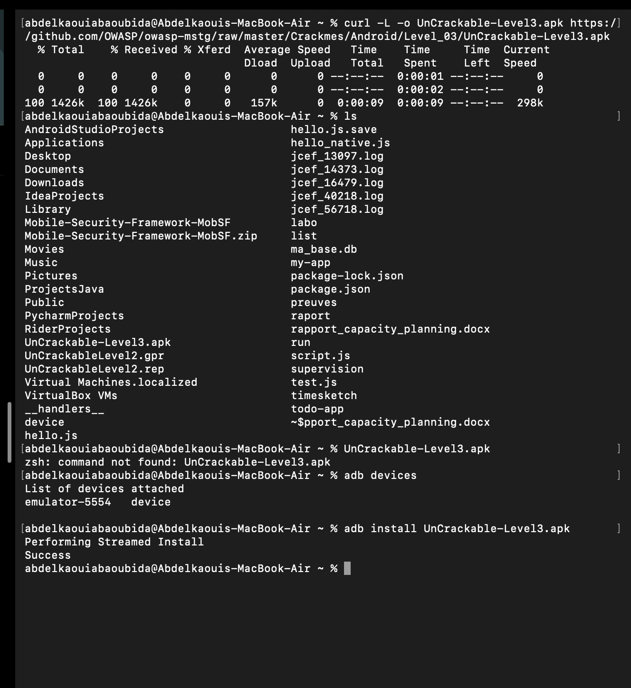

### ✅ Ce que montre cette capture
- Téléchargement du fichier `UnCrackable-Level3.apk`
- Vérification des appareils avec `adb devices`
- Installation réussie via `adb install`

---

# 🔍 Étape 2 — Analyse Java avec JADX

L’application a été ouverte dans JADX afin d’analyser le code Java décompilé.

Le fichier `MainActivity.java` contient :
- des vérifications de sécurité
- des méthodes natives
- des mécanismes anti-debug et anti-root

## 📷 Capture 2

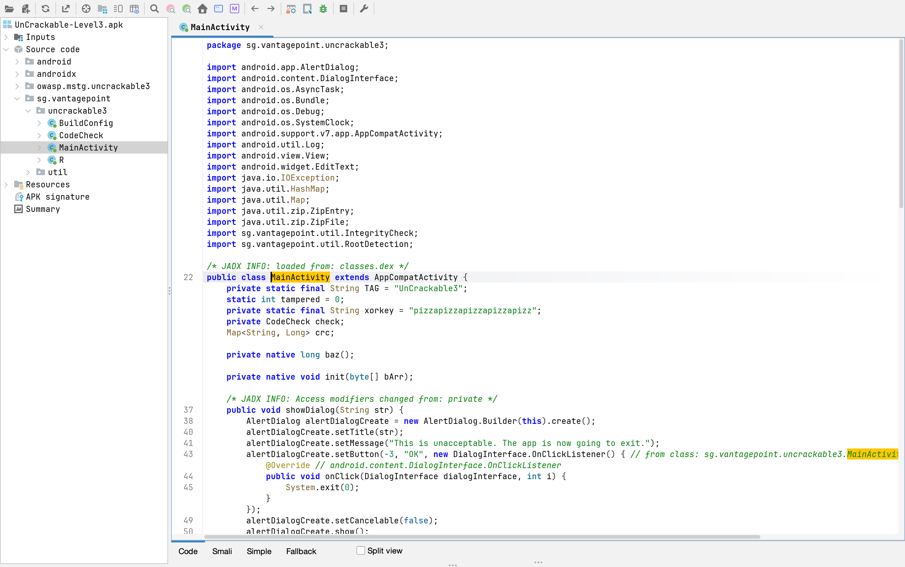

### ✅ Analyse
Cette capture montre :
- la classe `MainActivity`
- les imports liés à :
  - `IntegrityCheck`
  - `RootDetection`
- la présence des méthodes natives :
  ```java
  private native long baz();
  private native void init(byte[] bArr);
  ```

Cela indique que l’application utilise du code natif (`libfoo.so`) pour renforcer la protection.

---

# 🛡️ Étape 3 — Analyse des vérifications d’intégrité

La méthode `verifyLibs()` a été analysée afin de comprendre les mécanismes de détection de modification.

## 📷 Capture 3

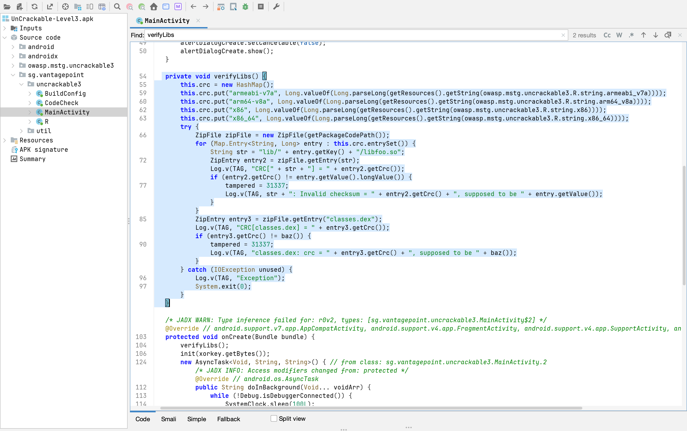

### ✅ Analyse
Cette fonction :
- calcule les CRC des bibliothèques natives
- compare les valeurs attendues avec les valeurs réelles
- détecte toute modification de l’APK

Les variables :
```java
tampered = 31337;
```

signalent une altération de l’application.

---

# ⚙️ Étape 4 — Décompilation avec APKTool

L’APK a été décompilé avec APKTool afin d’obtenir :
- les fichiers Smali
- les ressources
- le manifeste Android

## 📷 Capture 4

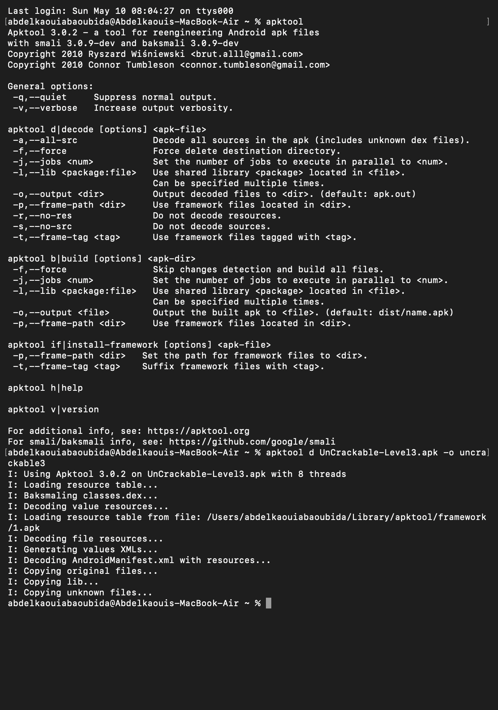

### ✅ Commande utilisée

```bash
apktool d UnCrackable-Level3.apk -o uncrackable3
```

### ✅ Résultat
APKTool :
- extrait les ressources
- décompile le code Smali
- prépare l’APK pour modification

---

# ✏️ Étape 5 — Localisation de la protection anti-root

Le fichier `MainActivity.smali` a été analysé pour identifier la logique anti-root.

## 📷 Capture 5

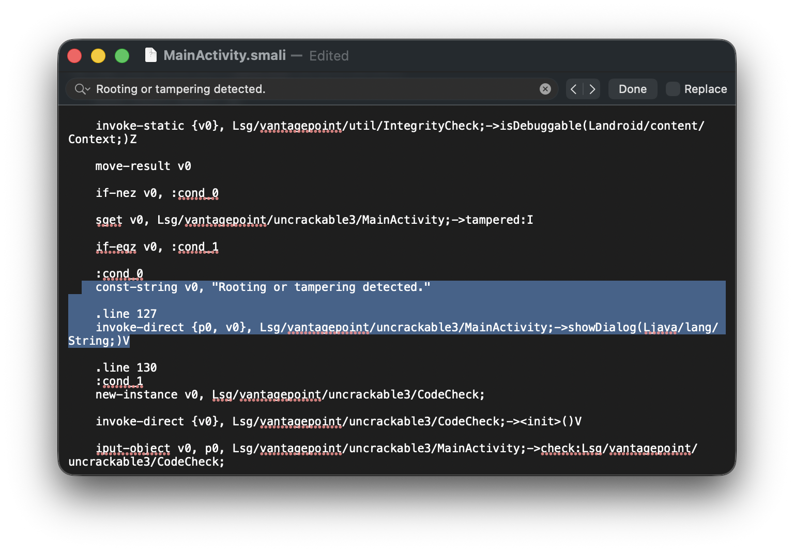

### ✅ Analyse
Cette portion de code affiche le message :

```text
Rooting or tampering detected.
```

et exécute :

```smali
invoke-direct {p0, v0}, Lsg/vantagepoint/uncrackable3/MainActivity;->showDialog(Ljava/lang/String;)V
```

---

# 🩹 Étape 6 — Patch de la protection

La logique de détection a été neutralisée.

## 📷 Capture 6

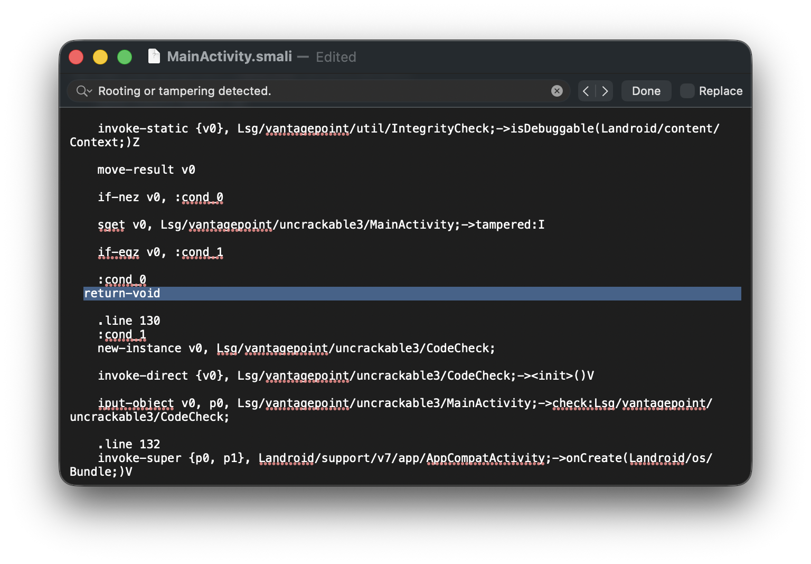

### ✅ Modification réalisée

Le code :

```smali
invoke-direct ...
```

a été remplacé par :

```smali
return-void
```

### ✅ Effet
L’application ignore désormais :
- le root
- le tampering
- les vérifications de sécurité

---

# 🔨 Étape 7 — Reconstruction de l’APK

L’application patchée a ensuite été recompilée.

## 📷 Capture 7

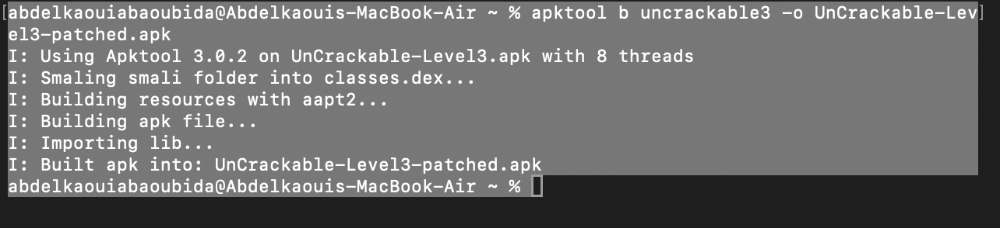

### ✅ Commande utilisée

```bash
apktool b uncrackable3 -o UnCrackable-Level3-patched.apk
```

### ✅ Résultat
APKTool reconstruit :
- le fichier APK
- les ressources
- les classes DEX

---

# 🔑 Étape 8 — Signature et installation de l’APK patché

L’APK recompilé a été signé avec `apksigner`.

## 📷 Capture 8

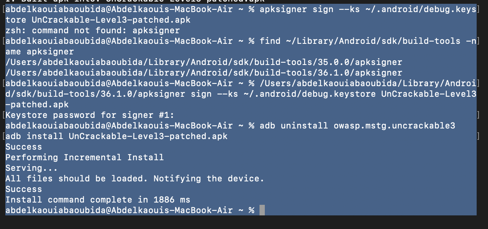

### ✅ Étapes réalisées

Recherche de `apksigner` :

```bash
find ~/Library/Android/sdk/build-tools -name apksigner
```

Signature :

```bash
apksigner sign --ks ~/.android/debug.keystore UnCrackable-Level3-patched.apk
```

Installation :

```bash
adb install UnCrackable-Level3-patched.apk
```

---

# 🚀 Étape 9 — Lancement de l’application patchée

L’application patchée a été lancée via `adb shell monkey`.

## 📷 Capture 9

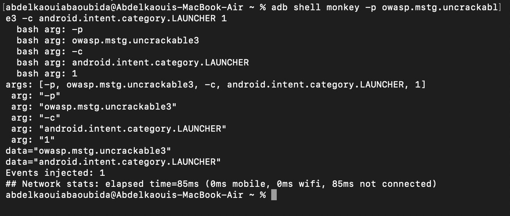

### ✅ Commande utilisée

```bash
adb shell monkey -p owasp.mstg.uncrackable3 -c android.intent.category.LAUNCHER 1
```

---

# 🚀 Étape 10 — Injection de l’événement de lancement

Une nouvelle tentative de lancement confirme le bon fonctionnement de l’application.

## 📷 Capture 10

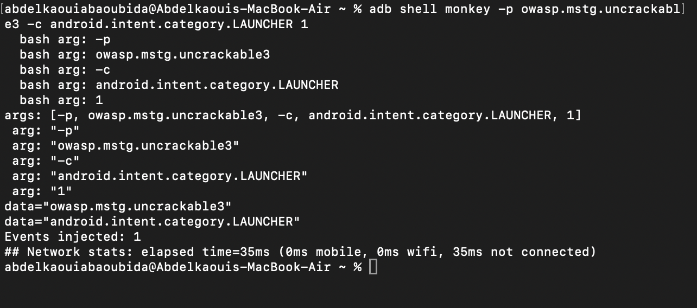

### ✅ Résultat
Le lancement s’effectue sans crash malgré :
- l’émulateur rooté
- les modifications de l’APK

---

# 📱 Étape 11 — Vérification du fonctionnement final

L’interface de l’application apparaît correctement.

## 📷 Capture 11

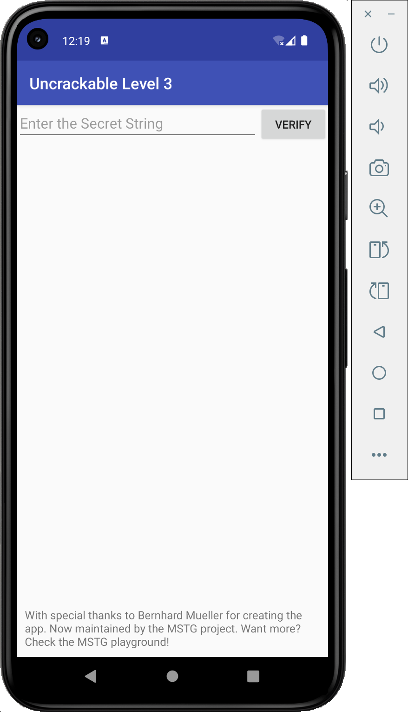

### ✅ Résultat
Le bypass de protection est réussi :
- l’application démarre normalement
- aucune alerte anti-root n’apparaît

---

# 🧠 Étape 12 — Analyse native avec Ghidra

Le fichier natif `libfoo.so` a été ouvert dans Ghidra.

## 📷 Capture 12

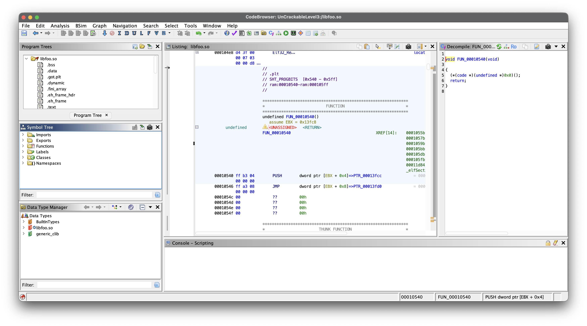

### ✅ Analyse
Cette capture montre :
- l’arbre des fonctions natives
- le désassemblage de `libfoo.so`
- le pseudo-code décompilé

---

# 🔍 Étape 13 — Identification de l’anti-debug natif

Une fonction utilisant `ptrace` a été identifiée.

## 📷 Capture 13

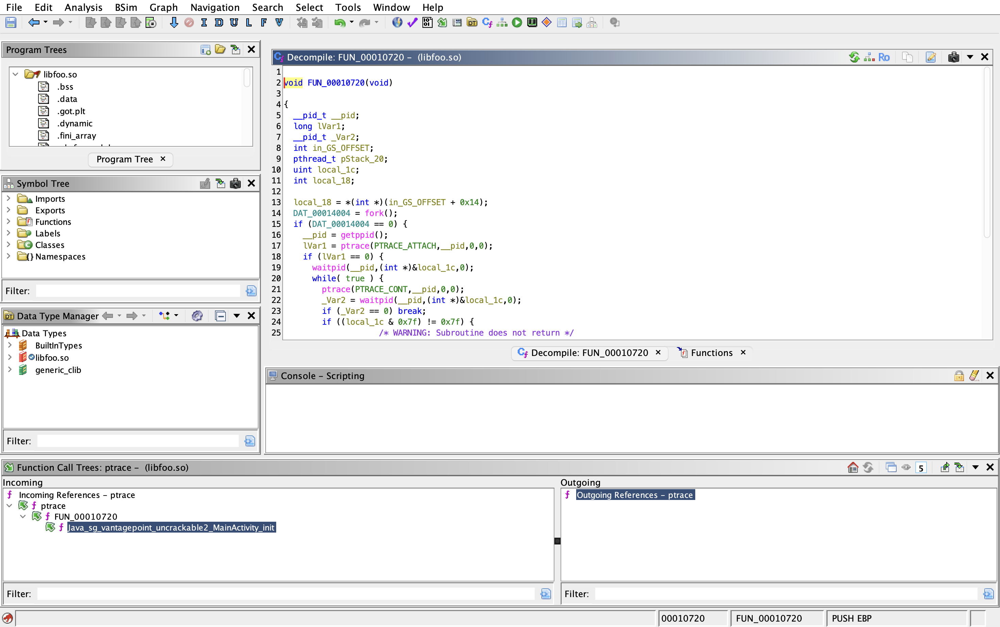

### ✅ Analyse
Le code :

```c
ptrace(PTRACE_ATTACH, ...)
```

sert à :
- détecter un debugger
- empêcher l’analyse dynamique

C’est une technique classique d’anti-debugging.

---

# 🩹 Étape 14 — Patch du code natif

La fonction native de protection a été modifiée dans Ghidra.

## 📷 Capture 14

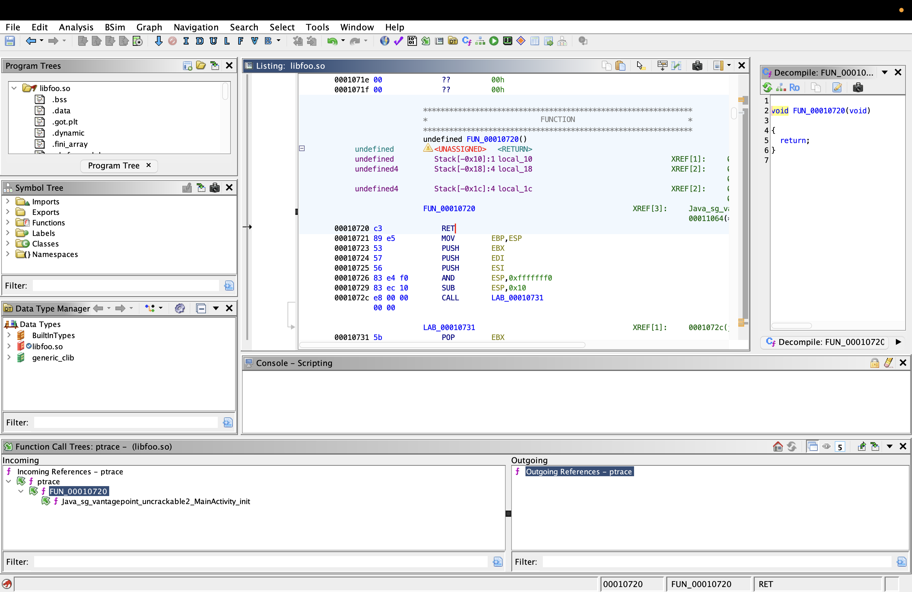

### ✅ Modification
La fonction a été remplacée par :

```c
return;
```

### ✅ Effet
Cela neutralise :
- l’anti-debugging
- les protections natives

---

# 🧾 Conclusion

Ce lab a permis de comprendre plusieurs techniques avancées de protection Android :

- Détection du root
- Vérification d’intégrité CRC
- Anti-debugging natif
- Protection JNI
- Validation des bibliothèques natives

Les outils utilisés :
- JADX
- APKTool
- Ghidra
- ADB
- apksigner

ont permis :
- d’analyser l’application
- de modifier le code Smali
- de patcher le code natif
- de reconstruire une version fonctionnelle de l’application

Ce type d’analyse est essentiel dans :
- le reverse engineering Android
- les audits de sécurité mobile
- les tests de pénétration d’applications Android

---
